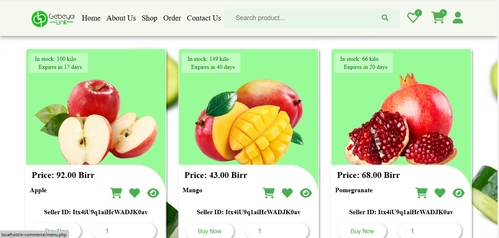

# Gebeya Link eCommerce
## Description

Gebeya Link is an eCommerce website dedicated to providing high-quality agricultural products while supporting local farmers. I focus on sustainable practices and connect consumers with ethically grown produce. At Gebeya Link, I deliver farm-to-table goodness with a purpose.

## Table of Contents

- [Description](#description)
- [Features](#features)
- [Screenshots](#screenshots)
- [Installation](#installation)
- [Usage](#usage)
- [Contributing](#contributing)
- [Contact](#contact)
- [More Information](#more-information)

## Features

*   High-quality agricultural products
*   Support for local farmers
*   Sustainable practices
*   Ethically sourced produce
*   Direct farm-to-table delivery

## Screenshots

<!-- Add your screenshots here -->

## Installation

Detailed steps on how to set up the project locally.  Example:

1.  Clone the repository: `git clone [repository URL]`
2.  Install dependencies: `composer install` (if using PHP and Composer)
3.  Set up the database:  (Provide specific instructions)
4.  Run migrations: (if applicable)

## Usage

Examples of how to use the website. Include code snippets or commands if applicable.

## Contributing

If you'd like to contribute, please follow these guidelines:

1.  Fork the repository.
2.  Create a new branch (`git checkout -b feature/your-feature`).
3.  Make your changes.
4.  Commit your changes (`git commit -m 'Add some feature'`).
5.  Push to the branch (`git push origin feature/your-feature`).
6.  Open a pull request.

## Contact

Fethiya Abdurehim - fethiyaabdurehim7@gmail.com

[https://www.linkedin.com/in/fethiya-abdurehim-3a0248331?utm_source=share&utm_campaign=share_via&utm_content=profile&utm_medium=android_app]

## More Information

For more details, visit [Gebeya Link](https://gebeya-link.infinityfreeapp.com/.gebeyalink.com).